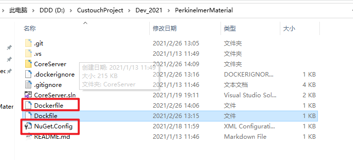

# docker常用命令与注意事项

1. **创建镜像image**: 

   docker image build -t [镜像名] .

2. **根据镜像创建一个运行的容器**:

   docker run -d -p [外部port]:[容器port] --name [容器名] [镜像名]

3. **查看运行中的容器**:

   docker container ls

4. **查看docker容器日志**:

   docker logs --since [时间:5m(五分钟)] [容器ID]
   
5. **Dockerfile**:

   + 内容
     ```
     FROM mcr.microsoft.com/dotnet/core/aspnet:3.1 AS base
     WORKDIR /app
     EXPOSE 80
     
     FROM mcr.microsoft.com/dotnet/core/sdk:3.1 AS build
     WORKDIR /src
     COPY ["voestalpineProduct/voestalpineProduct.csproj", "voestalpineProduct/"]
     RUN dotnet restore "voestalpineProduct/voestalpineProduct.csproj"
     COPY . .
     WORKDIR "/src/voestalpineProduct"
     RUN dotnet build "voestalpineProduct.csproj" -c Release -o /app/build
     
     FROM build AS publish
     RUN dotnet publish "voestalpineProduct.csproj" -c Release -o /app/publish
     
     FROM base AS final
     WORKDIR /app
     COPY --from=publish /app/publish .
     ENTRYPOINT ["dotnet", "voestalpineProduct.dll"]
     ```

   + dockerfile放在sln同级路径

     

   

6. **使用私有nuget包时**:

   + 需要Nuget.Config : 

     [文件路径]: D:\CustouchProject\1.开发任务\0.常用文件
   
   ```xml
   <?xml version="1.0" encoding="utf-8"?>
   <configuration>
     <packageSources>
       <!--To inherit the global NuGet package sources remove the <clear/> line below -->
       <clear />
       <add key="dotnet-core" value="https://dotnet.myget.org/F/dotnet-core/api/v3/index.json" />
       <add key="api.nuget.org" value="https://api.nuget.org/v3/index.json" />
       <add key="custouch.6199" value="http://120.26.129.150:6199/nuget" />
       <add key="custouch.6200" value="http://120.26.129.150:6200/nuget" />
     </packageSources>
</configuration>
   ```
   
+ 放在sln同级目录
     

   + Dockerfile
   
     ```
     FROM mcr.microsoft.com/dotnet/core/aspnet:3.1 AS base
     WORKDIR /app
     EXPOSE 80
     
     FROM mcr.microsoft.com/dotnet/core/sdk:3.1 AS build
     WORKDIR /src
     COPY NuGet.Config .       *****************************************增加这一行语句******************************************
     COPY ["voestalpineProduct/voestalpineProduct.csproj", "voestalpineProduct/"]
     RUN dotnet restore "voestalpineProduct/voestalpineProduct.csproj"
     COPY . .
     WORKDIR "/src/voestalpineProduct"
     RUN dotnet build "voestalpineProduct.csproj" -c Release -o /app/build
     
     FROM build AS publish
     RUN dotnet publish "voestalpineProduct.csproj" -c Release -o /app/publish
     
     FROM base AS final
     WORKDIR /app
     COPY --from=publish /app/publish .
  ENTRYPOINT ["dotnet", "voestalpineProduct.dll"]
    ```
  
     