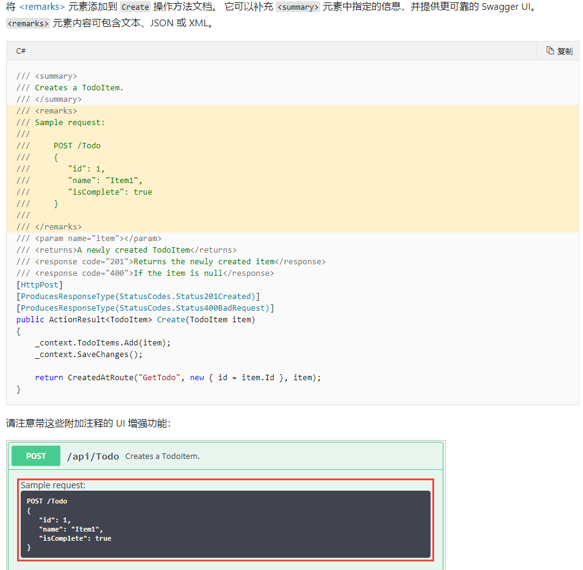
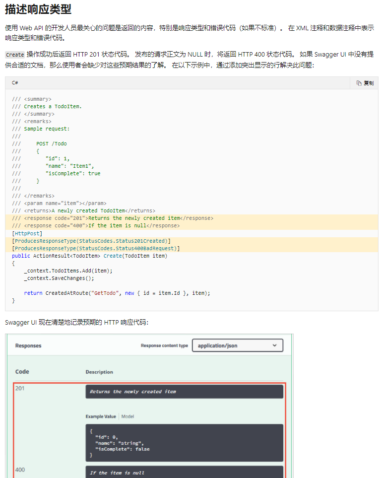
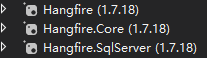
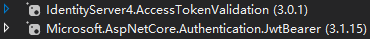
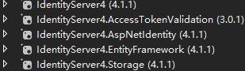

# 常用的服务

#### 1. **配置Configuration**: StartUp类中

   ```c#
   public IConfiguration Configuration {get;}
   
   public StartUp(IConfiguration configuration)
   {
      	Configuration = configuration;
   }
   ```

#### 2.**注册EF Core数据库**: 

   + **引用**

   + 连接串:  "SQLSERVER": "Server=192.168.1.131;Initial Catalog=voestalpineProduct;User ID=sa;Password=17931;"

   + StartUp类中: 
   
     ```c#
     services
     	.AddDbContext<Context>(config => config.UseSqlServer(Configuration["连接串Key"]))
         .AddUnitOfWork<Context>();
     
     ```


   + 在Configure类中: 在最开头 配置数据库自动迁移(**不太需要,一般生成一个sql脚本之后直接去数据库更新脚本**)
   
     ```c#
     using (var db = app.ApplicationServices.CreateScope().ServiceProvider.GetService<ProductContext>())
     {
         db.Database.Migrate();
     }
     ```


​     

   + 在Context中: Context名称以Context结尾, Context继承DbContext
   
     ```c#
      public DbSet<Product> Products { get; set; } //数据库实体
     
     public Context(DbContextOptions options):base(options){}
     
     protected override void OnModelCreating(ModelBuilder modelBuilder)
     {
      base.OnModelCreating(modelBuilder);
     }
     ```

   + 要使用的类中:
   
     ```c#
     readonly IRepository<Model>  _repo;
     
     readonly IUnitOfWork _unitOfWork;
     
     public Class(IUnitOfWork unitOfWork)
     {
     
     	_unitOfWork = unitOfWork;
     
     	_repo = unitOfWork.GetRepository<Model>();
     }
     ```


   + 使用:
   
     ```c#
     await _repo.InsertAsync(data);
     
     await _unitOfWork.SaveChangeAsync();
     ```
  
     

#### 3. **使用了【2】之后, 自定义服务只能使用AddScoped<IServcice,Service>();**

#### 4. **跨域设置**:

   + ```c#
      services.AddCors(option=>
      {
          option.AddPolicy("名称", builder =>
                           {
      
                               builder
                                   .SetIsOriginAllowed(_=>true)
                                   .AllowAnyMethod()
                                   .AllowAnyHeader()
                                   .AllowCredentials();
                           });
      });
      ```
   + ```c#
      app.UseCor("名称");
     ```
     
     或者在Controller的类名上加一个attribute: [EnableCors("web")]

#### 5. **注册Swagger**: 使用--https://ip:port/swagger

   + **引用**

   + ```c#
     services.AddSwaggerGen();
     ```

   + **需要验证时的配置**:

```c#
services.AddSwaggerGen(options =>
{
	options.AddSecurityDefinition("swagger安全方案名称A", new OpenApiSecurityScheme()
    {
    	Type = SecuritySchemeType.Http,
        //例如services.AddAuthentication("Bearer")的Bearer
        Scheme = "验证授权服务的方案名称", 
        In = ParameterLocation.Header,//jwt存放authorization信息的位置
        Flows = new OpenApiOAuthFlows()
        {
            Password = new OpenApiOAuthFlow()
            {
                TokenUrl = new Uri(Configuration["Access_Token:Request_Url"])
            }
        }
    });
    options.AddSecurityRequirement(new OpenApiSecurityRequirement()
	{
        {
            new OpenApiSecurityScheme
            {
                Reference = new OpenApiReference
                { 								
                    Type=ReferenceType.SecurityScheme,
                    Id="swagger安全方案名称A"
                }
            },
            new string[]{ }
        }
    });
    options.OperationFilter<FileUploadOperationFilter>();//允许swagger上传文件
    var xmlPath = Path.Combine(AppContext.BaseDirectory, xmlFile);//显示注释, 详见下方
    options.IncludeXmlComments(xmlPath, true);
});
```

​     

   + **在Userouting前**: 

```c#
app.UseSwagger();
app.UseSwaggerUI(c=>
{
	c.SwaggerEndpoint("/swagger/v1/swagger.json","名称");
});
 
```

+ swagger页面**显示注释:** 

  项目属性中设置：文档路径=obj\Debug\netcoreapp3.1\【项目名称】.xml

  
```c#
var xmlFile = $"{Assembly.GetExecutingAssembly().GetName().Name}.xml";

services.AddSwaggerGen(options =>
{
    options.OperationFilter<FileUploadOperationFilter>();//允许swagger上传文件
    options.OperationFilter<SwaggerHeaderParameter>();//允许swagger设置header
    var xmlPath = Path.Combine(AppContext.BaseDirectory, xmlFile);
    options.IncludeXmlComments(xmlPath, true);
});

/// <summary>
/// 实现swagger上传文件,只需在StartUp.ConfigureServices中添加swagger服务设置options
/// </summary>
public class FileUploadOperationFilter : IOperationFilter
{
    public void Apply(OpenApiOperation operation, OperationFilterContext context)
    {
        var files = context
            .ApiDescription
            .ActionDescriptor
            .Parameters.Where(c => c.ParameterType == typeof(IFormCollection))
            .ToList();
        if (files.Count > 0)
        {
            operation.Parameters.Clear();
            //设置文件上传
            var schema = new Dictionary<string, OpenApiSchema>
            {
                ["fileName"] = new OpenApiSchema { Description = "Select file", Type = "string", Format = "binary" }
            };
            var content = new Dictionary<string, OpenApiMediaType>
            {
                ["multipart/form-data"] = new OpenApiMediaType 
                                            { 
                    							Schema = new OpenApiSchema 
                                                            { 
                                                                Type = "object", 
                                                                Properties = schema 
                                                            } 
                                            }
            };
            operation.RequestBody = new OpenApiRequestBody() { Content = content };
        }
    }
}
/// <summary>
/// 实现swagger自定义header,只需在StartUp.ConfigureServices中添加swagger服务设置options
/// </summary>
 public class SwaggerHeaderParameter : IOperationFilter
 {
     public void Apply(OpenApiOperation operation, OperationFilterContext context)
     {
         operation.Parameters.Clear();
         var attrs = context.ApiDescription.ActionDescriptor.AttributeRouteInfo;
         if (context.ApiDescription.ActionDescriptor is ControllerActionDescriptor descriptor)
         {
             var actionAttributes = descriptor.MethodInfo.GetCustomAttributes(true);
             bool isAnonymous = actionAttributes.Any(a => a is AllowAnonymousAttribute);
             if (!isAnonymous)
             {
                 operation.Parameters.Add(new OpenApiParameter()
					{
                        Name = "X-Local-Userid",//*******************对应header的name**************************
                        In = ParameterLocation.Header,
                        Description = "e.g. {\"openid\":\"fasdfasdfsfasf\"}",
                        Required = false
                    });
             }
         }
     }
 }

/// <summary>
/// 实现swagger上传文件,使用自定义特性给你的API添加或者删除参数,只需在StartUp.ConfigureServices中添加swagger服务设置options
/// </summary>
public class SwaggerCustomFilter : IOperationFilter
{
    public void Apply(OpenApiOperation operation, OperationFilterContext context)
    {
        var files = context
            .ApiDescription
            .ActionDescriptor
            .Parameters.Where(c => c.ParameterType == typeof(IFormCollection))
            .ToList();
        #region 设置文件上传
        if (files.Count > 0)
        {
            operation.Parameters.Clear();
            var schema = new Dictionary<string, OpenApiSchema>
            {
                ["fileName"] = new OpenApiSchema 
                { 
                    Description = "Select file", 
                    Type = "string", 
                    Format = "binary" 
                }
            };
            var content = new Dictionary<string, OpenApiMediaType>
            {
                ["multipart/form-data"] = new OpenApiMediaType
                {
                    Schema = new OpenApiSchema
                    {
                        Type = "object",
                        Properties = schema
                    }
                }
            };
            operation.RequestBody = new OpenApiRequestBody() 
            { 
                Content = content 
            };
        }
        #endregion

		#region 设置自定义route参数
        var customAttributes = context
                                    .MethodInfo
                                    .DeclaringType
                                    .GetCustomAttributes(true);
        var actionAttribute = context.MethodInfo.GetCustomAttributes(true);
        var swaggerCustomAttribute =(
                                        customAttributes
                                        .Concat(actionAttribute)
                                    )
            						.OfType<SwaggerCustomAttribute>();
        //以上三行用于获取action的自定义特性SwaggerCustomAttribute

        if (swaggerCustomAttribute != null && swaggerCustomAttribute.Any())
        {
            operation.Parameters.Clear();
            if (swaggerCustomAttribute.First().NeedAuth)
            {
                operation.Parameters.Add(new OpenApiParameter()
                                         {
                                             Name = "Auth",
                                             In = ParameterLocation.Header,
                                             Description = "e.g. Guanglin1234! ",
                                             Required = false
                                         });
            }
            var customerParams = swaggerCustomAttribute
                                                .First()
                                                .CustomParams?
                                                .ToList();
            if (customerParams != null)
            {
                customerParams.ForEach(cp =>
				{
					var paramsKv = cp.Split(':', 
                                            StringSplitOptions.RemoveEmptyEntries
                                           );
                    operation.Parameters.Add(new OpenApiParameter
                                             {
                                                 Name = paramsKv[0],
                                                 In = ParameterLocation.Path,
                                                 Description = paramsKv[1],
                                                 Required = false
                                             });
                });
            }
        }
        #endregion
    }
}
```

+ 使用remark节点详细描述操作



+ 使用response code ="200"描述响应类型




#### 6. **日志**: 

   在要记日志的类Class中注入:

   ```c#
readonly ILogger<Class> _logger;

public Class(ILogger<Class>  logger)
{
    _logger = logger;
}
   ```

   

#### 7. **custouch.Kudmf.Application**:

   + ```c#
     Task<Output<ClassA>> Method;
     ```

   + ```c#
      return OutputHandler.Ok(result);
     ```
   
   + ```c#
      return OutputHandler.Exception<ClassA>(ex);
      ```
   + ```c#
     return OutputHandler.Error<ClassA>(-1, ErrorMsg);
     ```

#### 8. **AutoMapper**: [AutoMapper基本用法|CSDN](https://blog.csdn.net/wtf123654789/article/details/90445513) || [AutoMapper对象映射|W3xue](https://www.w3xue.com/exp/article/20201/72716.html) || [AutoMapper基本使用|CSDN](https://blog.csdn.net/qq_40579788/article/details/108408336)

   + **引用**:

   + 在构造函数中完成映射操作:

     > **CreateMap**：创建映射规则。
     >
     > **BeforeMap**：在映射之前执行的方法。
     >
     > **AfterMap**：反之，映射之后执行的方法。
     >
     > **自动扁平化映射**：AutoMapper会将类中的属性进行分割，或匹配“Get”开头的方法。
     >
     > **ForMember**：指定映射字段。
     
   + StartUp中:

     ```c#
     public void ConfigureServices(IServiceCollection services)
     {
         //MappingProfile为自定义Profile名
         services.AddAutoMapper(typeof(MappingProfile));
     }
     ```

   + Controller中:

     ```c#
     public class TestController
     {
         private readonly IMapper _mapper;
     
         public TestController(IMapper mapper)
         {
             _mapper = mapper;
         }
     }
     ```
     
   + **配置映射**: .netcore在Profile派生类的构造函数中进行配置映射

     ```c#
     //需要同时使用源和目标类型,只要Target的成员名称与Source源类型的成员名称匹配
     CreateMap<Source,Target>();
     //如果有一个名为“FirstName”的Source源成员，它将自动映射到名为“FirstName”的Target目标成员。
     
     
     //如果两个字段名称不一样,需要指定映射关系.ForMember()
     //ForMember(目标=>目标字段,options=>options.MapFrom(源=>源字段));
     CreateMap<Source, Target>()
         .ForMember(t => t.Target1, options => options.MapFrom(src => src.Source4))
         .ForMember(t => t.Target2, options => options.MapFrom(src => src.Source3))
         .ForMember(t => t.Target3, options => options.MapFrom(src => src.Source2))
         .ForMember(t => t.Target4, options => options.MapFrom(src => src.Source1));
     ```

+ Profile:

     ```c#
     public class MappingProfile:Profile
     {
         public MappingProfile()//构造函数
          {
             //创建映射规则A, 只对应同名字段
             CreateMap<Source, Target>();
             
             //创建映射规则B, 不仅对应同名字段,也对应自定义规则
             CreateMap<Source, Target>()
                 .ForMember(t => t.Target1, opt => opt.MapFrom(src => src.Source4))
                 .ForMember(t => t.Target2, opt => opt.MapFrom(src => src.Source3))
                 .ForMember(t => t.Target3, opt => opt.MapFrom(src => src.Source2))
                 .ForMember(t => t.Target4, opt => opt.MapFrom(src => src.Source1));
             
             //规则B包含了规则A,不需要再创建规则A
             
          }
      }
     
     
     public class Source
     {
         public string Source1 { get; set; }
         public string Source2 { get; set; }
         public string Source3 { get; set; }
         public string Source4 { get; set; }
     }
     
     public class Target
     {
         public string Target1 { get; set; }
         public string Target2 { get; set; }
         public string Target3 { get; set; }
         public string Target4 { get; set; }
         public string Target5 { get; set; }
     
         public string Source1 { get; set; }
         public string Source2 { get; set; }
         public string Source3 { get; set; }
         public string Source4 { get; set; }
     }
     ```

+ 调用

  ```c#
  [HttpPost("Test")]
  public IActionResult Post([FromBody] Source source)
  {
      var result = _mapper.Map<Source, Target>(source);
      return Ok(new
      {
          Type = result.GetType().Name,
          Data = result
      }) ;
  }
  
  
  /* 规则A
  request:
  {
    "source1": "1",
    "source2": "2",
    "source3": "3",
    "source4": "4"
  }
  reponse:
  {
    "type": "Target",
    "data": {
      "target1": null,
      "target2": null,
      "target3": null,
      "target4": null,
      "target5": null,
      "source1": "1",
      "source2": "2",
      "source3": "3",
      "source4": "4"
    }
  }
  */
  
  /* 规则B
  request:
  {
  "source1": "1",
    "source2": "2",
    "source3": "3",
    "source4": "4"
  }
  response:
  {
    "type": "Target",
    "data": {
      "target1": "4",
      "target2": "3",
      "target3": "2",
      "target4": "1",
      "target5": null,
      "source1": "1",
      "source2": "2",
      "source3": "3",
      "source4": "4"
    }
  }
  */
  ```
  
  


#### 9. **Hangfire**:https://www.leo96.com/article/detail/58 ||项目 微站BykPim

   + **引用**:

   + 调用地址: ip:port/hangfire

   + 注册服务:

   ```c#
   services.AddHangfire(configuration => 
   		configuration
				//设置兼容性
               .SetDataCompatibilityLevel(CompatibilityLevel.Version_170) 
				//使用简单程序集名称类型序列化
               .UseSimpleAssemblyNameTypeSerializer()	
				//使用推荐的序列化配置
               .UseRecommendedSerializerSettings()		
				//使用SQLServer存储, 需要Hangfire.SqlServer包,并先创建数据库
               .UseSqlServerStorage(					
                   Configuration.GetConnectionString("HangfireConnection"), 
                   new Hangfire.SqlServer.SqlServerStorageOptions
                   {	
                       //批处理命令超时时间
                       CommandBatchMaxTimeout = TimeSpan.FromMinutes(5),
                       //滑动超时
                       SlidingInvisibilityTimeout = TimeSpan.FromMinutes(5),
                       //队使用推荐的隔离等级
                       QueuePollInterval = TimeSpan.Zero,
                       //是否禁用全局锁
                       DisableGlobalLocks = true
                })
   );
   //将Hangfire处理服务器添加为IHostedService
   //此处添加后就不需要使用HangfireServer中间件, 无需调用app.UseHangfireServer()
   //即这里注入了Hangfire服务器, 就不需要使用Hangfire服务器中间件, 二者使用其一
   services.AddHangfireServer();
   
   ```

   + 配置中间件: 在授权中间件之后

   ```c#
   //引入Hangfire仪表板中间件, 仪表板是Hangfire的特色, 可以通过网页展示
   //默认情况下,Hangfire仪表板只允许本地访问, 需要配置【仪表板授权】才可以远程访问
   //需要包:Hangfire.AspNetCore
   app.UseHangfireDashboard();
   //backgroundJobClient为IBackgroundJobClient
   //添加一次性任务, 并立即执行
   backgroundJobClient.Enqueue(() => RefreshFile.RefreshDataSource());
   //每天22:35分 当前时区执行
   RecurringJob.AddOrUpdate(() => RefreshFile.RefreshDataSource(), Cron.Daily(22, 35));
   ```

#### 10. 配置身份验证服务:[IdentityServer4实现.NetCore API接口权限认证 | CSDN](https://blog.csdn.net/Qin066/article/details/105101551/)

> 在其他项目中调用【11.配置授权服务】**用于验证授权的服务A**来获取token

+ 引用:

+ 注册服务

  
    ```c#
    //way1:使用Jwt
    services.AddAuthentication("Bearer")//添加身份验证方案"Bearer"
        	.AddJwtBearer("Bearer", options =>
    		{
                options.Authority = "https://oauth.beta.custouch.com";//服务A的调用地址
    			options.RequireHttpsMetadata = false
                options.TokenValidationParameters = new TokenValidationParameters
                {
                    ValidateAudience = false //是否验证受众人
                };
            });
    
    //way2:使用identityServer4
    string scheme = IdentityServerAuthenticationDefaults.AuthenticationScheme;
    services
        .AddAuthentication(scheme)
        .AddIdentityServerAuthentication(scheme, options =>
    	{
    		options.ApiName = "Test";//需要身份验证的API名称
            options.Authority = "https://oauth.beta.custouch.com";//服务A的调用地址
            options.RequireHttpsMetadata = false;
        });
    
    ```
    
    + 配置中间件:
    
    ```c#
    app.UseAuthorization();
    ```

   

#### 11. **配置授权服务**:[OAuth 2.0(一种授权机制) 的四种方式 | 阮一峰](http://www.ruanyifeng.com/blog/2019/04/oauth-grant-types.html)

> 用于搭建**验证授权的服务A**并且部署,提供给其他项目token

+ 引用: 

+ 注册服务

  ```c#
  services.AddIdentityService(Configuration);
  services.AddIdentityServer()//添加IdentityServer服务
      	.AddSigningCredential(new X509Certificate2("IS4.pfx", "Varex1234"))
        	.AddConfigurationStore(options =>  //使用ef存储客户端和资源信息
          {
        		options.ConfigureDbContext = builder => 				
                  builder
                  	.UseSqlServer(connectionString, sql =>
                      {
                          //配置EF数据迁移定义所在的程序集
                          sql.MigrationsAssembly(migrationsAssembly);
                      });
          })
        	.AddOperationalStore(options => //添加操作数据
  		{
    			options.ConfigureDbContext = builder => 
                  builder
                  	.UseSqlServer(connectionString, sql =>
                      {
                          sql.MigrationsAssembly(migrationsAssembly);
                      });
              options.EnableTokenCleanup = true;//token自动清理
              options.TokenCleanupInterval = 3600; //token自动清理间隔:默认一小时
              options.TokenCleanupBatchSize = 100;//token每次自动清理的数量
          })
        .AddAspNetIdentity<User>()
        .AddExtensionGrantValidator<WeiXinOpenGrantValidator>()
        .AddProfileService<ApplicationProfileService>();
  ```
  
    + 配置中间件
  
    ```c#
    app.UseIdentityServer();
    ```


