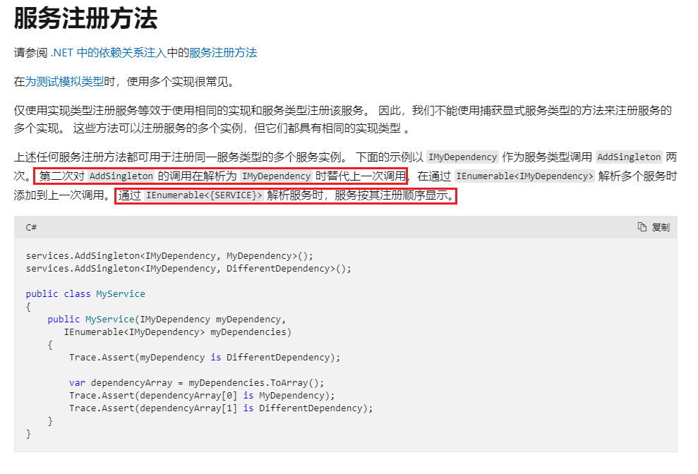

# .NetCore 依赖注入

1. 单接口服务, 多实例服务的情况, 即需要注册多个继承同一个interface的服务

   ```c#
               services.TryAddEnumerable(ServiceDescriptor.Scoped<IDataAnalyticsServices, CourseAnalyticsService>());
   services.TryAddEnumerable(ServiceDescriptor.Scoped<IDataAnalyticsServices, LearnerAnalyticsService>());
   ```

   

   