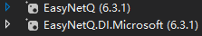

# EasyNetQ队列消息

### 安装环境

> [Windows下安装RabbitMQ | 博客园](https://www.cnblogs.com/niuben/p/12812440.html)
>
> **notice**: 安装rabbitMQ之后进行的环境设置中, cmd命令应为 **.\命令**
>
> [MQ启动报错rabbitmq-plugins : 无法将“rabbitmq-plugins”项识别为 cmdlet、函数、脚本文件或可运行程序的名称 | CSDN](https://blog.csdn.net/weixin_44012027/article/details/105293467)

> 引用: 

### 快速使用

 ```c#
//传递的自定义消息类、自定义队列名Test以及自定义交换名exchange
[Queue("Test",ExchangeName = "testExchange")]
public class TextMessage
{
    public string Text { get; set; }
}
 ```

1. 发布Publish:

```c#
using var bus = RabbitHutch.CreateBus("host=localhost");
//两种发布方式
//way1
bus.PubSub.Publish(new TextMessage { Text = input });
//way2
bus.PubSub.PublishAsync(new TextMessage { Text = input }).ConfigureAwait(false);
Console.WriteLine("Message published!");
```

2. 订阅Subscribe:**要订阅消息，我们需要在消息到达时为EasyNetQ提供一个要执行的操作delegate。我们通过传递一个委托来实现该操作**

```c#
using var bus = RabbitHutch.CreateBus("host=localhost");
bus.PubSub.Subscribe<TextMessage>("test", delegateMsg => 
{
    Console.WriteLine("test Got message:{0}",delegateMsg.Text);
});

//或者将delegate单独拿出
bus.PubSub.Subscribe<TextMessage>("test", HandleTextMessage);

static void HandleTextMessage(TextMessage textMessage)
{
    Console.ForegroundColor = ConsoleColor.Red;
    Console.WriteLine("Got message:{0}", textMessage.Text);
    Console.ResetColor();
}

//或者异步
bus
  .PubSub
  .SubscribeAsync<TextMessage>(
        "subscribeasync_test", msg =>
        new WebClient()
        .DownloadStringTaskAsync(new Uri(""))
        .ContinueWith(task=>                              												Console.WriteLine($"收到:'{msg.Text}',下载:'{task.Result}'")
                     )
        );
```

3. 取消订阅:

```c#
var subscriptionResult = bus.Subscribe<TextMessage>("sub_id",HandleTextMessage);
//取消订阅-两种方式: 会停止消费队列,并关闭消费通道
//way1
subscriptionResult.Dispose();
//way2
subscriptionResult.ConsumerCancellation.Dispose();

```

4. 多态处理: refs[EasyNetQ Wiki | GitHub](https://github.com/EasyNetQ/EasyNetQ/wiki/Polymorphic-Publish-and-Subscribe)
5. 自动订阅: 

```c#
//StartUp中注册服务
services.RegisterEasyNetQ(rabbitmqConnection);

//实现接口IConsume<T>或者IConsumeAsync<T>的类会自动订阅到指定的队列中
//自动订阅的逻辑
public class AutoConsumer : IConsume<TextMessage>
{
    public void Consume(TextMessage message, CancellationToken cancellationToken = default)
    {
        Console.WriteLine("Auto test: " + message.Text);
    }
}

//发布
public async Task<IActionResult> Publish([FromQuery] string message, [FromServices] IBus bus)
{
    var subscriber = new AutoSubscriber(bus, "auto_test");
    subscriber.Subscribe(new Assembly[] 
                         { 
                             Assembly.GetAssembly(typeof(TestAutoConsumer)) 
                         });
    await bus.PubSub.PublishAsync(new Message { Content = message });
    return Ok();
}

//结果
//在发布的时候,订阅的消息会自动弹出,不用启动订阅console
//类似事件触发

```


### 注意事项:

1. refs:[EasyNetQ Wiki-Subscribe | GitHub](https://github.com/EasyNetQ/EasyNetQ/wiki/Subscribe)

>+ 一旦通过调用Subscribe()方法设置了对某个消息类型MsgA的订阅后, 就会在RabbitMQ代理上创建一个持久队列, 并且MsgA类型的所有消息都会放到这个队列上
>+ 只有delegate完成之后, 消息传递才会被RabbitMQ确认(acked), 如果delegate是个长时间运行的操作, 那么在操作进行时,这个消息会被标记为未确认(unacked)
>+ 如果有一些中断, 比如电源故障或者网络中断, 未确认的消息会被保留在队列的最前面, 因此要考虑到这种情况, 即准备好发送同一个消息的多个副本
>+ **传递给Subscribe的订阅ID很重要**, EasyNetQ会在RabbitMQ代理上为消息类型和订阅ID的每个唯一组合创建一个唯一的队列
>+ 每次调用Subscribe()都会创建一个新的队列消费者
>+ 如果使用相同的消息类型和订阅ID调用Subscribe()两次,则会创建两个从同一个队列上消费的消费者. RabbitMQ会依次发送消息给每个使用者
>+ 如果使用相同的消息类型和不同的订阅ID调用Subscribe()两次, 则会创建两个队列, 每个队列有属于自己的消费者. RabbitMQ会把给定类型的每条消息的副本送到每个队列上, 因此每个消费者都会获得这个类型的所有消息.**如果有多个不同的服务都订阅同一个消息类型, 那就用这个方法**
>+ 所有subscribe方法都返回ISubscriptionResult, 这个接口对象包含IExchange和IQueue, 这两个接口属性在描述基础IConsumer中也有使用.
>+ dispose IBus和IAdvancedBus实例会取消所有消费者并关闭他们到RabbitMQ的连接
>+ **不要**在消息处理时调用subscriptionResult.Dispose()