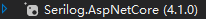

# Serilog

### 安装

1. 引用:

> Install-Package Serilog.Sinks.File

### 配置-在StartUp中

```c#
public Startup(IConfiguration configuration)
{
    Configuration = configuration;
    var directory = new DirectoryInfo(
                                        Assembly
                                        .GetExecutingAssembly()
                                        .GetName()
                                        .Name
    								);
    var filePath = directory.Parent.FullName + "/logs";
    if (!Directory.Exists(filePath))
    {
        Directory.CreateDirectory(filePath);
    }
    //代码中配置
    Log.Logger = new LoggerConfiguration()
        .MinimumLevel.Information()
        .WriteTo.File("./logs/log.txt", rollingInterval: RollingInterval.Day)
        .CreateLogger();
    
	//从appsettings.json中读取配置:见jsonA或jsonB
    Log.Logger = new LoggerConfiguration()
                        .MinimumLevel
                        .Information()
                        .ReadFrom
                        .Configuration(
                            new ConfigurationBuilder()
                                    .AddJsonFile("appsettings.json")
                                    .Build()
                        	)
        				.CreateLogger();
    
}
```

```json
***********jsonA***********
{
  "AllowedHosts": "*",
  "Logging": {
    "LogLevel": {
      "Default": "Information",
      "Microsoft": "Warning",
      "Microsoft.Hosting.Lifetime": "Information"
    }
  },
  "Serilog": {
    "WriteTo": [
      {
        "Name": "File",
        "Args": {
          "path": "./logs/logs.txt",
          "rollingInterval": "Day"
        }
      }
    ]
  }
}

***********jsonB***********
{
  "AllowedHosts": "*",
  "Logging": {
    "LogLevel": {
      "Default": "Information",
      "Microsoft": "Warning",
      "Microsoft.Hosting.Lifetime": "Information"
    }
  },
  "Serilog": {
    "WriteTo": [
      {
        "Name": "File",
        "Args": {
          "path": "./logs/myapp.json",
          "rollingInterval": "Day",
          "formatter": "Serilog.Formatting.Compact.CompactJsonFormatter,Serilog.Formatting.Compact"
        }
      }
    ]
  }
}

```


### 调用

```c#
public class TestController : ControllerBase
{
    private readonly ILogger<TestController> _logger;

    public TestController(ILogger<TestController> logger)
    {
        _logger = logger;
    }
    
    [HttpGet("publish")]
    public async Task<IActionResult> Publish([FromQuery] string message)
    {
        //记录日志
        Log.Information("创建订阅队列");
        Log.Information("发布完成");
        //使用模版消息,使用配置jsonB
        Log.Information("this is a message to publish that {@msg} at {Now}", 
                        new Message { Content = message }, 
                        DateTimeOffset.Now.ToOffset(new TimeSpan(8,0,0))
                       );
        return Ok(message);
    }
}
```


### References

1. [SeriLog学习 | CSDN](https://blog.csdn.net/kkaazz/article/details/104227200#_70)

2. [Serilog | GitHub](https://github.com/serilog)
3. [Serilog-Formatting-Compact | GitHub](https://github.com/serilog/serilog-formatting-compact/tree/dev)