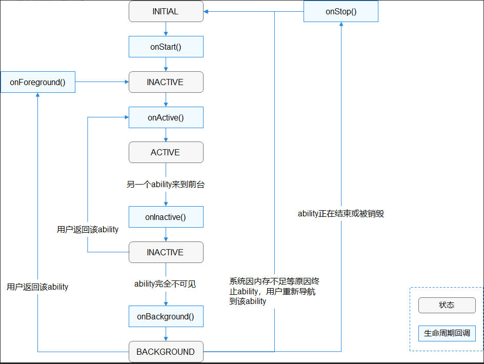

# Ability

## Ability基础

> 1. Ability: 应用程序的功能, **HarmonyOS支持应用程序以Ability为单位进行部署, 即只安装应用程序的部分功能**
>
>    Ability分为两种: 

- Feature Ability(FA), 元服务, **有界面, 用于和用户交互, 包含一组页面(AbilitySlice)**
  - Page Ability, Page模板, 是FA唯一支持的模板, 一个Page实例包含一组页面(a collection of AbilitySlice)
  - AbilitySlice, 切片, **是一个应用程序的一个页面, 包含交互逻辑**
- Particle Ability(PA), 元能力, **无界面, 是后台服务, 用于计算或数据仓库**
  - Service Ability, Service模板, 用于提供后台运行任务的能力
  - Data Ability, Data模板, 用于对外部提供统一的数据访问能力

> 2. 注册Ability: 在配置文件中(config.json), 可以通过配置Ability.type属性来指定Ability模板类型
>
> ```json
> {
>     "module": {
>         ...
>         "abilities": [
>             {
>                 ...
>                 "type": "page"
>                 //type取值范围:
>                 //1.page(Page模板)
>                 //2.service(service模板)
>                 //3.data(data模板)
>                 ...
>             }
>         ]
>         ...
>     }
>     ...
> }
> ```

## Page Ability

> 3. [AbilitySlice路由配置](https://developer.harmonyos.com/cn/docs/documentation/doc-guides/ability-page-concept-0000000000033573#ZH-CN_TOPIC_0000001083176865__section553610411543)
>    
>    - Page进入前台时界面默认只展示一个AbilitySlice
>    - **setMainRoute()方法**用来指定默认展示的AbilitySlice
>    - **addActionRoute()方法**用来指定不同情况的默认展示AbilitySlice, 即当其他Page实例想要导航到指定的AbilitySlice时,使用此方法
>
>    ```java
>    public class MyAbility extends Ability {
>        @Override
>        public void onStart(Intent intent) {
>            super.onStart(intent);
>            // set the main route
>            setMainRoute(MainSlice.class.getName());
>    
>            // set the action route
>            addActionRoute("action.pay", PaySlice.class.getName());
>            addActionRoute("action.scan", ScanSlice.class.getName());
>        }
>    }
>    ```
>    
>    - addActionRoute()方法中用到的action名, 需要在配置文件中(config.json)注册
>    
>    ```json
>    {
>        "module": {
>            "abilities": [
>                {
>                    "skills":[
>                        {
>                            "actions":[
>                                "action.pay",
>                                "action.scan"
>                            ]
>                        }
>                    ]
>                    ...
>                }
>            ]
>            ...
>        }
>        ...
>    }
>    ```
>

> 4. [Page Ability生命周期](https://developer.harmonyos.com/cn/docs/documentation/doc-guides/ability-page-lifecycle-0000000000029840#ZH-CN_TOPIC_0000001083455837__section1188919218574)



> 5. 同一个Page内的AbilitySlice相互跳转[AbilitySlice间导航](https://developer.harmonyos.com/cn/docs/documentation/doc-guides/ability-page-switching-0000000000037999)

```java
@Override
protected void onStart(Intent intent) {
    Button button = ...;
    button.setClickedListener(listener -> present(new TargetSlice(), new Intent()));
	//new TargetSlice()即实例化一个目标AbilitySlice
}


//具体如下
@Override
public void onStart(Intent intent) {
    super.onStart(intent);
    super.setUIContent(ResourceTable.Layout_ability_main);
    Button button = (Button) findComponentById(ResourceTable.Id_button);

    // 点击按钮跳转至第二个页面, new SeconAbilitySlice()为目标AbilitySlice
    button.setClickedListener(listener -> present(new SecondAbilitySlice(), new Intent()));
}


public class SecondAbilitySlice extends AbilitySlice {
    @Override
    public void onStart(Intent intent) {
        super.onStart(intent);
        ...
    }
}
```

> 6. 同一个Page内从目标AbilitySlice返回时, 可以获得返回结果,:
>    - 具体使用presentForResult()方法实现导航
>    - 用户从目标AbilitySlice返回时, 系统会调用onResult()方法来接收处理返回结果, **需要重写此方法**
>    - 返回结果需要在目标AbilitySlice通过setResult()方式设置

```java
@Override
protected void onStart(Intent intent) {
    ...
    Button button = ...;
    button.setClickedListener(listener -> presentForResult(new TargetSlice(), new Intent(), 0));
    ...
}

@Override
protected void onResult(int requestCode, Intent resultIntent) {
    if (requestCode == 0) {
        // Process resultIntent here.
    }
}

public class TargetSlice extends AbilitySlice {
    @Override
    public void onStart(Intent intent) {
        super.onStart(intent);
        ...
        setResult();
    }
    
}
```

> 7. [不同Page间的AbilitySlice间导航](https://developer.harmonyos.com/cn/docs/documentation/doc-guides/ability-page-switching-0000000000037999#ZH-CN_TOPIC_0000001076963678__section1862412142519)

> 8. [跨设备迁移](https://developer.harmonyos.com/cn/docs/documentation/doc-guides/ability-page-cross-device-0000001051072880)

## Service Ability

> 1. Service主要用于后台运行的任务(音乐播放、文件下载等), 
>    - 不提供用户交互界面
>    - Service也是一种Ability
>    - 可由其他应用程序或Ability启动, 即便用户切换到其他的应用程序, Service仍会在后台继续进行
>    - **在一个设备上相同的Service只会存在一个实例**
>    - 多个Ability共用一个Service实例时, 只有当与Service实例绑定的所有Ability都退出后, Service才能退出
>    - Service是在主线程里执行的, 如果Service中的操作时间过长, 必须在Service里创建新的线程来处理

> 2. [创建Service](https://developer.harmonyos.com/cn/docs/documentation/doc-guides/ability-service-creating-0000000000044464), Service的生命周期方法如下:
>
>    - onStart(), 在创建Service时调用, 用于Service初始化, 在Service的整个生命周期中只调用一次, 调用时传入的Intent参数应为空
>
>    - onCommand(), 在Service创建完成之后调用, **会在客户端每次启动该service时都会调用, 可以在该方法中进行调用统计、初始化类等操作**
>
>    - onConnect(), 在第一个客户端的Ability和Service的第一次连接时调用, 该方法返回IRemoteObject对象, 用户可在该方法中生成对应Service的IPC通信通道(用于Service和Ability交互). 
>
>      ***注:** Ability可多次连接同一个Service, 系统会缓存该Service的IPC通信对象, **只有第一个客户端连接到Service时, 系统才会调用Service的onConnect()来生成IRemoteObject对象,** 而后系统会将**同一个RemoteObject对象传递给其他连接到同一个Service的所有客户端, 不用再调用onConnect()**
>
>    - onDisconnect(), 在Ability与绑定的Service断开连接时调用
>
>    - onStop(), 在Service销毁时调用, Service应通过实现该方法来清理资源, 包括关闭线程, 关闭注册的侦听器

```java
public class ServiceAbility extends Ability {
    @Override
    public void onStart(Intent intent) {
        super.onStart(intent);
    }

    @Override
    public void onCommand(Intent intent, boolean restart, int startId) {
        super.onCommand(intent, restart, startId);
    }

    @Override
    public IRemoteObject onConnect(Intent intent) {
        return super.onConnect(intent);
    }

    @Override
    public void onDisconnect(Intent intent) {
        super.onDisconnect(intent);
    }

    @Override
    public void onStop() {
        super.onStop();
    }
}
```

> 3. 注册Service, 需要在配置文件中注册,type为service

```json
{
    "module": {
        "abilities": [         
            {    
                "name": ".ServiceAbility",
                "type": "service",
                "visible": true
                ...
            }
        ]
        ...
    }
    ...
}
```

> 4. [启动Service](https://developer.harmonyos.com/cn/docs/documentation/doc-guides/ability-service-starting-0000000000044465), 通过startAbility()方法启动另一个Ability或Service, 因为Service也是一种Ability, 可以将Intent参数传给startAbility()来启动Service, 支持启动本地设备Serivce和远程设备Service
>    - Intent参数需要设置三个字段
>      - DeviceId: 设备ID, 本地设备可为空"",远程设备ID可以通过ohos.distributedschedule.interwork.DeviceManager的getDeviceList()方法获取设备列表
>      - BundleName: 包名称
>      - AbilityName: 待启动的Ability名称
>    - Ability通过startAbility()方法启动Service
>      - 如果Service尚未运行, 系统会先调用onStart()初始化Service, 再回调Service的onCommand()方法启动Service
>      - 如果Service正在运行, 则系统会直接回调Service的onCommand()方法启动Service

```java
//启动本地设备Service
Intent intent = new Intent();
Operation operation = new Intent.OperationBuilder()
        .withDeviceId("")
        .withBundleName("com.domainname.hiworld.himusic")
        .withAbilityName("com.domainname.hiworld.himusic.ServiceAbility")
        .build();
intent.setOperation(operation);
startAbility(intent);

//启动远程设备Service
Intent intent = new Intent();
Operation operation = new Intent.OperationBuilder()
        .withDeviceId("deviceId")
        .withBundleName("com.domainname.hiworld.himusic")
        .withAbilityName("com.domainname.hiworld.himusic.ServiceAbility")
        // 设置支持分布式调度系统多设备启动的标识
        .withFlags(Intent.FLAG_ABILITYSLICE_MULTI_DEVICE) 
        .build();
intent.setOperation(operation);
startAbility(intent);
```

> 5. 停止Service
>    - Service一旦创建就会一直在后台运行, 除非必须回收内存资源, 否则系统不会停止销毁Serivce
>    - 开发者可以在Service中调用terminateAbility()来停止该Service
>    - 开发者可以在其他Ability中调用stopAbility()来停止Service
>    - 支持停止本地设备Service和远程设备Service, 使用方法同启动Service

> 6. 连接Service
>    - Service需要与Page Ability或其他应用程序的Service Ability进行交互时, 需创建用于连接的Connection
>    - 其他Ability可以通过connectAbility()方法与Service进行连接
>    - connectAbility()方法须传入参数:
>      - 目标Service的Intent
>      - IAbilityConnection实例, 其中有两个待实现的方法
>        - onAbilityConnectDone()处理连接Serivce成功之后的回调
>        - onAbilityDisconnectDone()处理Service异常死亡的回调
>    - Service侧需要在onConnect()时返回IRemoteObject, 用于定义与Service进行通信的接口
>    - IRemoteObject需要用户继承LocalRemoteObject来创建自定义的IRemoteObject实现类
>

```java
//*************************Ability侧*************************

// 创建连接Service回调实例
private IAbilityConnection connection = new IAbilityConnection() {
    // 连接到Service的回调
    @Override
    public void onAbilityConnectDone(ElementName elementName, IRemoteObject iRemoteObject, int resultCode) {
// Client侧需要定义与Service侧相同的IRemoteObject实现类。开发者获取服务端传过来IRemoteObject对象，并从中解析出服务端传过来的信息。
    }

    // Service异常死亡的回调
    @Override
    public void onAbilityDisconnectDone(ElementName elementName, int resultCode) {
    }
};

// 连接Service
Intent intent = new Intent();
Operation operation = new Intent.OperationBuilder()
        .withDeviceId("deviceId")
        .withBundleName("com.domainname.hiworld.himusic")
        .withAbilityName("com.domainname.hiworld.himusic.ServiceAbility")
        .build();
intent.setOperation(operation);
connectAbility(intent, connection);


//*************************Service侧*************************

// 创建自定义IRemoteObject实现类
private class MyRemoteObject extends LocalRemoteObject {
    MyRemoteObject(){
    }
}

// 把IRemoteObject返回给客户端
@Override
protected IRemoteObject onConnect(Intent intent) {
    return new MyRemoteObject();
}


```

> 7. [Service Ability生命周期](https://developer.harmonyos.com/cn/docs/documentation/doc-guides/ability-service-lifecycle-0000000000044472)两种路径
>
>    - **启动Service(左)**
>
>      该Service在其他Ability调用startAbility()时创建，然后保持运行。其他Ability通过调用stopAbility()来停止Service，Service停止后，系统会将其销毁。
>
>    - **连接Service(右)**
>
>      该Service在其他Ability调用connectAbility()时创建，客户端可通过调用disconnectAbility()断开连接。多个客户端可以绑定到相同Service，而且当所有绑定全部取消后，系统即会销毁该Service。


> 8. [前台Service](https://developer.harmonyos.com/cn/docs/documentation/doc-guides/ability-service-foreground-0000000000044473)
>
>    前台Service可以让应用程序一直保持运行, 同时会在系统状态栏中显示图标

## Data Service

> 1. Data主要用于数据存储和访问, 并提供与其他应用程序共享数据的方法, **支持跨应用、跨设备的数据共享**
> 2. 类似数据库, 有crud
> 3. [数据存储方式2种](https://developer.harmonyos.com/cn/docs/documentation/doc-guides/ability-data-creating-0000000000043074)

