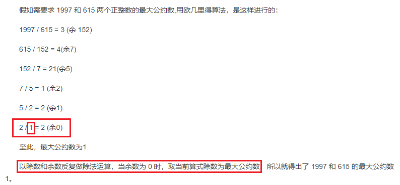

# 求最大公约数与最小公倍数

## 欧几里得算法-辗转相除法

#### 用于计算两个非负整数a,b的最大公约数gcd( the Greatest Common Divisor)

#### 最小公倍数lcm(the Least Common Multiple)

$$
lcm = \frac{ab}{gcd(a,b)}
$$

即, `a与b的乘积 ` = `a和b的最小公倍数`  *  `a和b的最大公约数`

