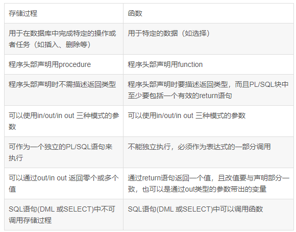

# 常见面试题

1. 存储过程是什么？如何使用存储过程？

   > 存储过程是一个预编译的SQL语句
   >
   > - 可以用一个命令对象来调用存储过程
   > - 可以供外部程序调用

2. 存储过程的优缺点

   > 优点：
   >
   > - 存储过程经过预编译，执行效率高
   > - 存储过程的代码直接存放于数据库中，通过存储过程名直接调用，减少网络通讯
   > - 安全性高，执行存储过程需要有一定的权限
   > - 存储过程可以重复使用，可减少数据库开发人员的工作量

   > 缺点：移植性差

3. 存储过程与函数的区别

4. 触发器是什么？作用是什么？

   > 触发器是一种特殊的存储过程，主要是通过事件来触发执行的。
   >
   > - 它可以强化约束，来维护数据的完整性和一致性；
   > - 可以跟踪数据库内的操作从而不允许未经许可的更新与修改；
   > - 可以联级运算，例如一张表A上的触发器上包含对另一张表B的数据操作，而该操作又会导致表B的触发器被触发。

5. 存储过程与函数的区别

   

6. 索引是什么？优缺点是什么？

   > - 索引是一种特殊的查询表，数据库的搜索可以利用它加速对数据的检索，它跟书的目录很类似，不需要查询整本书的内容就可以找到想要的数据。
   >
   > - 索引可以是唯一的，创建索引允许指定单个列或者多个列组合。
   >
   > - 缺点是它减慢了数据录入的速度，同时也增加了数据库的尺寸大小。

7. 索引类型有哪些？

   > single column——单列索引
   >
   > Concatenated——多列索引
   >
   > Unique——唯一索引
   >
   > NonUnique——非唯一索引
   >
   > Function-based——函数索引
   >
   > Domain——域索引：
   >
   > - Partitioned—分区索引
   > - NonPartitioned—非分区索引
   >
   > B-tree：
   >
   > - Normal—正常型B树
   > - Rever Key—反转型B树
   > - Bitmap—位图索引

8. 事务是什么？锁是什么？