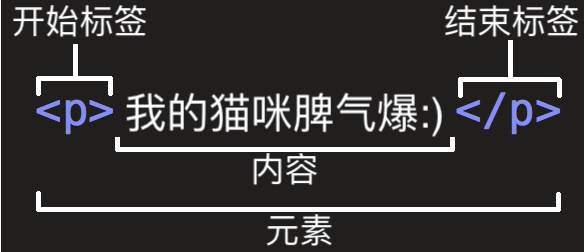
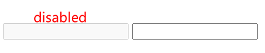
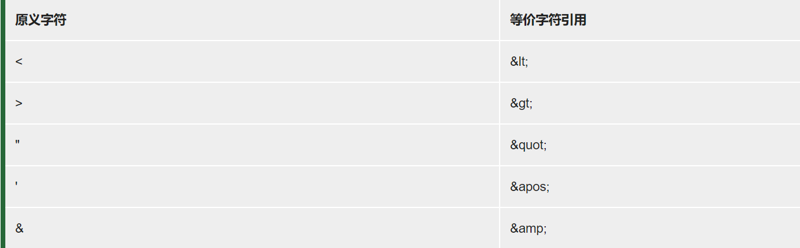

# HTML

### 参考:

> [HTML 基础 - 学习 Web 开发 | MDN](https://developer.mozilla.org/zh-CN/docs/Learn/Getting_started_with_the_web/HTML_basics)

### 1. HTML超文本标记语言

> 由一系列元素elements组成: 
>
> 1. 开始标签Opening tag
> 2. 结束标签Closing tag
> 3. 内容Content



> 4. 元素属性Attribute--属性包含了元素的一些额外信息, 这些信息本身不显示在内容中. 如图, 
>
>    - 属性与元素之间的空格符
>    - 多个属性之间需要空格
>    - **class 属性名称**
>    - **editor-note 属性的值, 由引号包围**
>
>    class属性可以为元素提供一个标识, 以便进一步为元素指定样式或进行其他操作


### 2. 嵌套元素

> ​	一个元素嵌套在另一个元素中

```html
<P>
    我的猫咪<strong>脾气差</strong>!!!
</P>
```

### 3. 空元素

> 不包含任何内容的元素

```html

```

### 4. HTML详解

```html
<!DOCTYPE html>	--文档类型,仅用于保证文档正常读取, 是最短且有效的文档声明
<html>			--html元素, 包含整个页面的内容,又叫根元素
  <head>		
 --head元素, 其内容对用户不可见是一个容器,包含了所有你想包含在html页面中但不想在页面中显示的内容,主要包含:面向搜索引擎的搜索关键字(keywords)、页面描述、CSS样式表、字符编码声明
      				
    <meta charset="utf-8">	--meta元素, 声明字符编码
    <title>测试页面</title>	 --title元素, 设置页面标题,显示在【浏览器标签页】以及【书签名称】
  </head>
  <body>		--body元素,包含让用户可看到的内容,包含: 文本、图片、音频、游戏
    
  </body>
</html>
```

### 5. 图像

```html

```

> 1.  src属性(source): 图像路径的地址
> 2. alt属性: 替换文字属性, 是图像的描述内容, 当图像不能被用户看见时显示该属性值

### 6. 标记文本-一些常用的文本标记元素

> 1. 标题heading-用于指定内容的标题和子标题, 一共**六个级别**: <h1>到<h6>

### 7. 布尔属性

> 1. 没有值的属性, 是合法的. 这种属性是布尔属性, 他们只能有跟自己的属性名一样的属性值.
>
> 例如`disabled`属性, 可以让表单输入变灰色, 此时用户不用输入

```html
<input type="text" disabled>
<input type="text">
```

 

### 8.引号

> 1. 单引号''和双引号""是一样的. 没区别.

### 9. 特殊字符

> 

