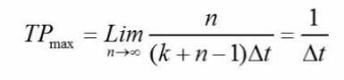
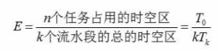
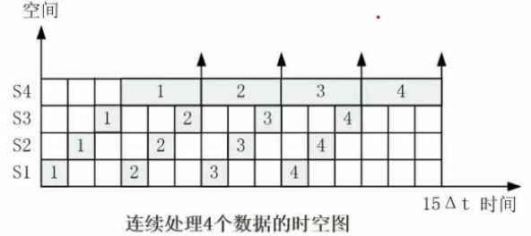

# 计算机组成与体系结构

[计算机组成与体系结构 | CSDN博客](https://blog.csdn.net/imreal_/article/details/113964628)

### 第一节.数据的表示

1. 进制的转换
   - `n进制→十进制`: 将n进制的每一位非零数字用该位的数字a与n^k 的乘积表示(a * n^k)然后将所有的乘积相加,  其中k值跟该位到小数点的距离有关，小数点左边第一位为0，小数点右边第一位为-1，往左递增(0,1,2,3,4,5,...,n)，往右递减(-1,-2,-3,...,-n)，如：二进制数10100.01=1 * 2^4 +1 * 2^2 +1 * 2^(-2)
   - `十进制→n进制`: 整数位使用短除法，即将十进制数除以n取余,得到的商继续除以n取余,反复操作，直至余数为零,然后将余数由下往上按顺序排列；小数位乘以n，每乘一次就取它的整数位（ 整数位为零时就取零)，直至小数位为零，然后将取得的整数位由上往下排列即可
   - `二进制→八进制`: 将二进制数以小数点为界, 向左及向右每三个一组; 缺的数用零来补充，然后依次转化为相应的进制数然后按顺序排列
   - `二进制→十六进制`: 将二进制数以小数点为界, 向左及向右每四个一组; 缺的数用零来补充，然后依次转化为相应的进制数然后按顺序排列
   
2. 原码、反码、补码、移码

   - `原码`: 将一个十进制数转换为二进制数，该二进制数的左侧首位表示正负，0表示正+，1表示负-，不足八位的就在首位与二进制数中间用0填充; 如-1的原码就是1000 0001

   - `反码`: 正数的反码为本身, 负数的反码为其原码除了首位不变之外其余全部取反, 即0变1, 1变0; 原码在计算机中进行加减不能得到正确的答案，而反码的加减则符合事实

   - `补码`: 正数的补码与原码相同, 负数的补码即为其反码+1

   - `移码`: 将正数和负数的补码首位取反, 其余不改变

   - 原码、反码、补码的`数值表示范围`: 其中n一般为8

     

3. 浮点数运算

   - `浮点数`: 即科学计数法, 如1000=1×10^3; 其中，1为尾数，10为基数，3为指数
   - `计算机中浮点数的运算`: 当两个指数不等的浮点数相加时，计算机会把低阶浮点数的指数转化为高阶浮点数的指数，如：1.0×10^3 + 1.19×10^2 ,计算机会将1.19×10^2 转化为0.119×10^3 ,然后作和，然后结果格式化(即通过指数的转化保证尾数必须为非零的一位数)如：0.1119×10^3 +1.119×10^2 ;得到11.3019×10^3 以后，要化为1.13019×10^4

### 第二节.中央处理器(CPU)-由运算器和控制器组成

1. 运算器(ALU)包括: 
   - `累加寄存器(AC)`: 专门存放算术或逻辑运算的一个操作数和运算结果的寄存器。能进行加，减，读出，移位，求补等操作。是运算器的主要部分。
   - `程序状态寄存器(PSW)`：该部件用来存放两类信息，一类是体现当前指令执行结果的各种状态信息(条件码)，如有无进位，有无溢出，结果正负，信息是否为零等；另一类是存放控制信息，如允许中断，跟踪标志等。
2. 控制器包括:
   - `程序计数器(PC)`：程序计数器中存放的是下一条指令的地址。由于多数情况下程序是顺序执行的，所以程序计数器设计成自动加一的装置。当出现转移指令时，就需重填程序计数器
   - `指令寄存器(IR)`：中央处理器正在执行的操作码表存放在这里，即当前正在执行的所有指令
   - `指令译码器`：将操作码解码，告诉中央处理器该做什么。
   - `时序部件`
3. 注意事项
   - CPU的寻址方式除了直接寻址以外还有多种寻址方式，目的是为了在效率和方便性上找一个平衡
   - CPU根据指令周期的不同阶段来区分内存中以二进制编码形式存放的指令和数据
   - 指令最先进入到数据寄存器暂存起来，然后在拿到指令寄存器中，再交由指令译码器来解码进而运算(交给运算器)，而这过程一结束就会迅速提取程序计数器中的指令(即下一条指令)，因此程序计数器中存储的始终是暂未执行的，下一条指令的“地址”；

###  第三节.计算机体系结构分类-Flynn分类法简介 

###  第四节.CISC和RISC

###  第五节.流水线

1. 流水线的基本概念

   - `指令执行的流程`：取指—分析—执行, `注`：指令执行步骤可能多于三步，应根据题意作答
   - `流水线的概念`：流水线是指在程序执行时多条指令重叠进行操作的一种准并行处理实现技术。各种部件同时处理是针对不同指令而言的，他们可以同时为多条指令的不同部分进行工作，以提高各部分的利用率和指令的平均执行速度

2. 流水线周期及流水线执行时间计算

   - `流水线周期计算`：流水线周期为执行时间最长的一段

   - `流水线执行时间计算`：

     (1) `理论公式`：

     > 1条指令完整执行的时间+(指令条数-1) × 流水线周期；

     (2) `实际公式`(实际生产中工厂往往采用该方法，因为该方法效率更高)：

     >  一个完整指令的步骤数+(指令条数-1) × 流水线周期；

     `注`：计算时优先用理论公式，选项中没有该答案时再采用实际公式

3. 流水线——流水线吞吐率计算

   - `概念`：是指在单位时间内流水线所完成的任务数量或输出的结果数量
   - `计算公式`：TP = 指令条数/流水线执行时间

   $$
   TP = \frac{指令数}{流水线执行时间}
   $$

   

   - `流水线最大吞吐率计算公式`：

     ​																									其中Δt是流水线周期

4. 流水线——流水线的加速比

   - `概念`：完成同样一批任务，不使用流水线所用的时间与使用流水线所用的时间之比称为流水线的加速比

   - `加速比计算公式`：
     $$
     流水线加速比S=\frac{不使用流水线的执行时间}{使用流水线执行时间}
     $$
     

5. 流水线——流水线的效率

   - `概念`：指流水线的设备利用率

   - `计算公式`：

     即从图形面积求解面积:

     

     该流水线的效率即为T0=24/KTk=60；等于0.4

     `注`：所有步骤花费时间相等的指令执行的效率最高

###  第六节.层次化存储器结构

### 第七节.cache

   > 

### 第八节.主存

   > 

### 第九节.磁盘结构与参数

   > 

### 第十节.总线

   > 

### 第十一节.系统可靠性分析与设计

### 第十二节.差错控制-CRC与海明校验码

> 

###  第十三节.输入输出系统

